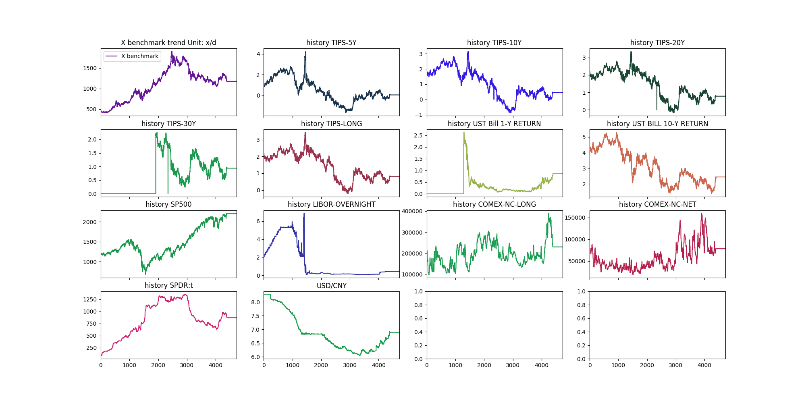

# 利用深度学习动态调整交易策略

### 1. 分析
本课题是基于X标的走势、相关指标的历史数据，分析X标的未来变化，直观上来看，应是一个回归问题。本文的主要思路按照这一个大的方向，在已有的数据的基础上分析X标的变化与给出的指标之间的关系，从而基于相关指标的情况，对X标进行预测。此外，也可以对这一问题进行扩展，由于时效性的原因，如果我们在得到其它指标的情况下，对X标进行预测，这样价值可能不大，但是如果我们能深入发掘X标与其它指标的关系，在需要时，我们可能对基它的指标有一定的衡量和预测手段，这样可以间接的对X标进行预测。

### 2. 数据分析
2.1. 根据给出的数据，我们画出了X标和其它相关指标的走势图：
2.2 相关分析
