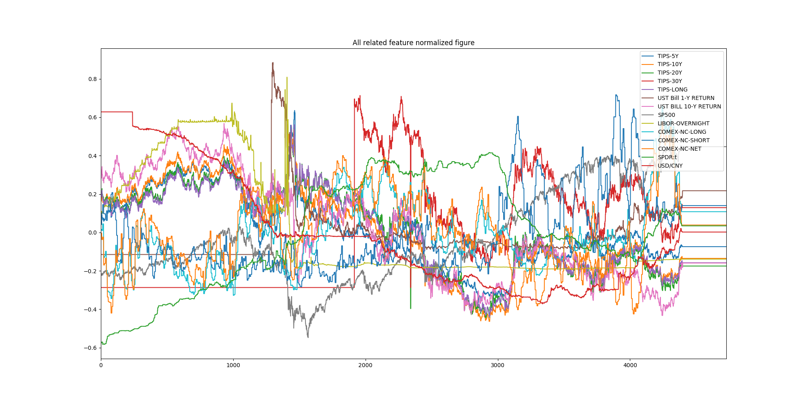
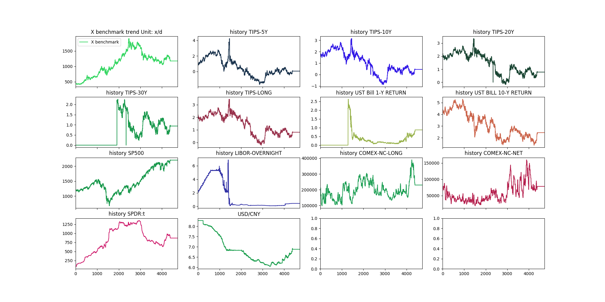

# 利用深度学习动态调整交易策略

### 1. 分析
本课题是基于X标的走势、相关指标的历史数据，分析X标的未来变化，直观上来看，应是一个回归问题。本文的主要思路按照这一个大的方向，在已有的数据的基础上分析X标的变化与给出的指标之间的关系，从而基于相关指标的情况，对X标进行预测。此外，也可以对这一问题进行扩展，由于时效性的原因，如果我们在得到其它指标的情况下，对X标进行预测，这样价值可能不大，但是如果我们能深入发掘X标与其它指标的关系，在需要时，我们可能对基它的指标有一定的衡量和预测手段，这样可以间接的对X标进行预测。

### 2. 数据分析
#### 2.1. 根据给出的数据，我们画出了X标和其它相关指标的走势图 



#### 2.2 相关分析
| 字段 | 说明 |
| ---- | --- |
|x benchmark | 总体走势为先增后降 |
| TIPS-5Y | 此指标大体与X标走势相反 |
| TIPS-10Y | 此指标与TIPS-5Y大致相当，与X标基本是相反的变化 |
| TIPS-20Y | 同上 |
| TIPS-30Y | 在前期引指标基本没有变，估计是没有数据，后期变化很快，对于X标的预估可能作用不大，我们分析此指标与X标的关系 |
| TIPS-LONG | 此指标与TIPS-(5/10/20)变化基本相同，与X标变化基本相反 |
| UST BILL 1-Y RETURN | 此数据，前面一部分缺失，后其有一定的相关性，使用时，可以选择有用的数据进行分析处理 |
| UST BILL 10-Y RETURN | 此数据，走势变化有一定的规律可寻，可以做为参照 |
| SP500 | 此部分，变化趋很明显，但是对比X标的变化，关联可能不大，我们之后能过相关分析进行难 |
| LIBOR-OVERNIGHT | 此数据整体变化与X标的关系不是很明显 |
| COMEX-NC-LONG | 与X标可以看出一定的关系 |
| COMEX-NC-NET | 与X标有一定的对应关系 |
| SPDR-t | 与X标的变化几乎相同，有很大的参考价值 |
| USD/CNY | 与X标的变与几乎成负相关 |

#### 2.3 总结
从数据中，我们可以看出有部分数据对结果可能有很大的影响，有些数据或者因为数据缺失或者因为相关性不大，我们准备使用，但为了验证我们的猜想，可以用来进行对比。

### 3. 算法设计与分析
1. 可以猜想，认为X标的变化，就是参照其它数据变化生成的，因此我们认为其是一个回归问题，我们使用MSE loss，以及分析不同的因素组合来分析变化情况，使用GBRT进行回归拟合

2. 算法运行情况

| Base | Train/Test | Epoch | Learning rate | Test loss |
| --- | --- | --- | --- | --- |
| TIPS-5Y | 7/3 | 10000 | 0.1 | 18361.20452821178 |
| TIPS-10Y | 7/3 | 10000 | 0.1 | 72199.85359137581 |
| TIPS-20Y | 7/3 | 10000 | 0.1 | 206137.5294652102 |
| TIPS-30Y | 7/3 | 10000 | 0.1 | 222576.7876718556 |
| TIPS-LONG | 7/3 | 10000 | 0.1 | 152743.73472397853 |
| UST BILL 1-Y RETURN | 7/3 | 10000 | 0.1 | 94450.57637815738 |
| UST BILL 10-Y RETURN | 7/3 | 10000 | 0.1 | 139184.95688278848 |
| SP500 | 7/3 | 10000 | 0.1 | **5690.335493387296** |
| LIBOR-OVERNIGHT | 7/3 | 10000 | 0.1 | 140029.5744900607 |
| COMEX-NC-LONG | 7/3 | 10000 | 0.1 | 259621.6101744508 |
| COMEX-NC-NET | 7/3 | 10000 | 0.1 | 279930.97413507494 |
| SPDR-t | 7/3 | 10000 | 0.1 | 193138.52943071476 |
| USD/CNY | 7/3 | 10000 | 0.1 | 84059.57934314759 |
| TIPS-5Y+SP500 | 7/3 | 50000 | 0.01 | 11492.905763721594 |
| TIPS-5Y+UST BILL 1-Y RETURN+SP500 | 7/3 | 50000 | 0.01 | 20508.219181798577 |
| TIPS-5Y+UST BILL 1-Y RETURN+SP500+USD/CNY | 7/3 | 50000 | 0.01 | **8003.32428286175** |
| TIPS-5Y+UST BILL 1-Y RETURN+SP500+COMEX-NC-LONG+USD/CNY | 7/3 | 50000 | 0.01 | **5249.6404209809025** |
| TIPS-5Y+UST BILL 1-Y RETURN+SP500+COMEX-NC-LONG+USD/CNY | 7/3 | 100000 | 0.01 | 5249.375062112708 |
| all | 7/3 | 50000 | 0.01 | 27685.449864680813 |

3. 分析

由上述运行结果可以发现，就单个而言，**SP500**和X标的变化最为相似，对于多组数据，我们可以发现**(TIPS-5Y+UST BILL 1-Y RETURN, SP500+COMEX-NC-LONG, USD/CNY)**达到的效果最好，`MSE = 5249`，通过计算，对于所有的X标，我们所取的测试数据相关情况如为`AVG(均值) = 1214, MAX(最大值)=1381.4, MIN(最小值)=1051.6`，所以测试数据误差为72左右。因此，可以知道平均误差大概在`5%`左右，已经达到一比较高的精度。

### 4. 总结
虽然使用常规的回归算法，我们已经达到了一定的精度，但是还有许多因素是没有考虑到的，比如当前结果可能受之前的结果影响，这一情况使用深度学习中的RNN是一个很好的处理方法，但考虑到数据的变化情况，此模型可能达不到预期效果。

#### 5. 文件结构
```
.
├── Readme.md 模型，以及相关情况总述
└── code 代理等
    ├── f1.png 整体变化展示
    ├── f2.png 趋势分析图
    ├── gbrt.py GBRT回归分析
    ├── graph.py 图生成
    ├── history.xlsx 历史数据
    └── predict.xlsx 需要预测的数据
```
